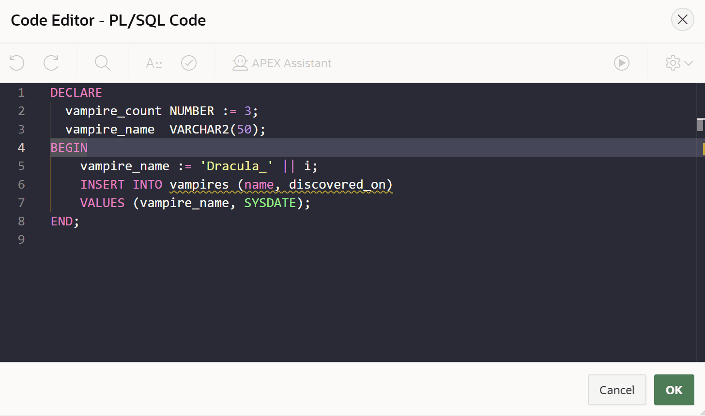
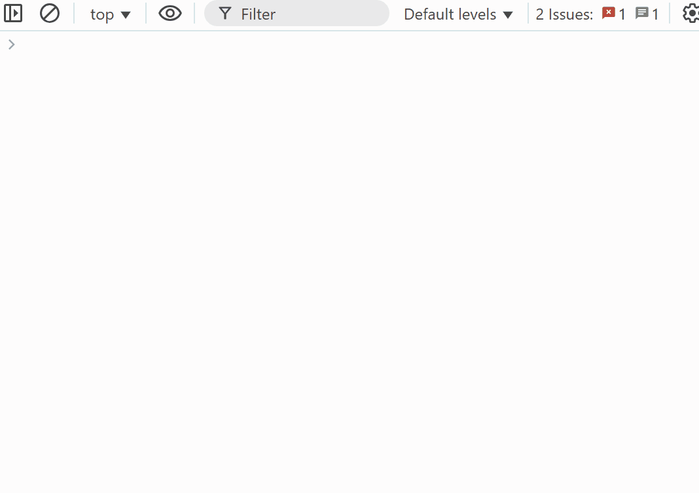
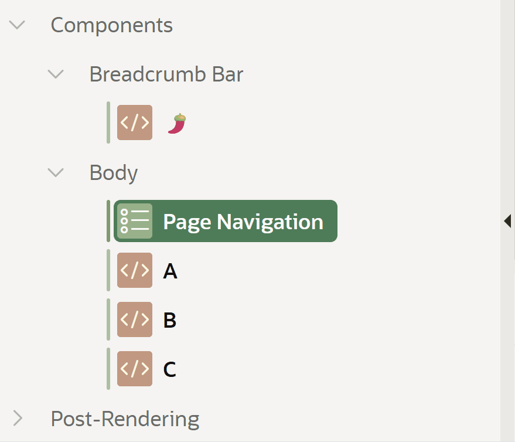
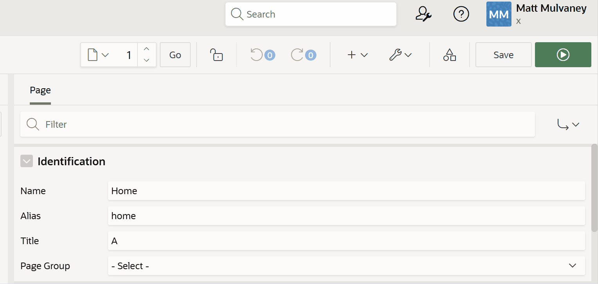

# Oracle APEX Userscripts

> **Experimental Use Only**  
> These scripts are provided for experimental use only. Use at your own risk.  
> Not supported by Oracle or my employer.

A collection of userscripts to enhance the Oracle APEX development experience. Each script targets specific productivity or usability improvements for Oracle APEX developers and administrators.

---

## Table of Contents

1. [Overview](#overview)
2. [Script Previews](#script-previews)
3. [Script Details](#script-details)
4. [Using These Userscripts with Tampermonkey](#using-these-userscripts-with-tampermonkey)
5. [License](#license)

---

## Overview

This repository contains the following userscripts for Oracle APEX:

| Script Name | Version   | Description |
|-------------|-----------|-------------|
| [Auto-hide Header](scripts/oracle-apex-auto-hide-header/readme.md) | 24.2.2 | Collapses the Oracle APEX header and expands it on hover, with user-configurable settings. Provides more screen for small displays.  |
| [Monaco Theme](scripts/oracle-apex-monaco-theme/readme.md) | 24.2.1 | Applies custom themes (e.g., Dracula) to the Monaco Editor in Oracle APEX. |
| [Page Designer Shortcuts](scripts/oracle-apex-page-designer-shortcuts/readme.md) | 24.2.5 | Adds global keyboard shortcuts for common actions in Oracle APEX Page Designer, such as saving and running pages. |
| [Session Auto-Extender](scripts/oracle-apex-session-auto-extender/readme.md) | 24.2.2 | Automatically extends your APEX session to prevent idle timeouts, with customizable intervals. |
| [Toggle Comment Out](scripts/oracle-apex-toggle-comment-out/readme.md) | 24.2.2 | Adds a keyboard shortcut to toggle the "Comment Out" build option for selected components in the Page Designer. |
| [Page Designer Undo/Redo Counters](scripts/oracle-apex-page-designer-undo-redo-counters/readme.md) | 24.2.1 | Shows live undo and redo counts next to Page Designer toolbar buttons using native badge styling. |

---

## Script Previews

### Auto-hide Header

### Monaco Theme

### Page Designer Shortcuts

### Session Auto-Extender

### Toggle Comment Out

### Page Designer Undo/Redo Counters

---

## Script Details

### 1. Auto-hide Header
- **Location:** [`scripts/oracle-apex-auto-hide-header/readme.md`](scripts/oracle-apex-auto-hide-header/readme.md)
- **Description:** Automatically collapses the Oracle APEX header and expands it on hover. User-configurable trigger bar, delay, and transition.

### 2. Monaco Theme
- **Location:** [`scripts/oracle-apex-monaco-theme/readme.md`](scripts/oracle-apex-monaco-theme/readme.md)
- **Description:** Applies custom themes (e.g., Dracula) to the Monaco Editor in Oracle APEX. Easily switch themes by editing the script.

### 3. Page Designer Shortcuts
- **Location:** [`scripts/oracle-apex-page-designer-shortcuts/readme.md`](scripts/oracle-apex-page-designer-shortcuts/readme.md)
- **Description:** Adds global keyboard shortcuts for common actions in Oracle APEX Page Designer, such as saving and running pages.

### 4. Session Auto-Extender
- **Location:** [`scripts/oracle-apex-session-auto-extender/readme.md`](scripts/oracle-apex-session-auto-extender/readme.md)
- **Description:** Automatically extends your APEX session to prevent idle timeouts, with customizable intervals.

### 5. Toggle Comment Out
- **Location:** [`scripts/oracle-apex-toggle-comment-out/readme.md`](scripts/oracle-apex-toggle-comment-out/readme.md)
- **Description:** Adds a keyboard shortcut to toggle the "Comment Out" build option for selected components in the Page Designer.

### 6. Page Designer Undo/Redo Counters
- **Location:** [`scripts/oracle-apex-page-designer-undo-redo-counters/readme.md`](scripts/oracle-apex-page-designer-undo-redo-counters/readme.md)
- **Description:** Shows live undo and redo counts beside the Page Designer toolbar Undo/Redo buttons. Uses native `a-Button-badge` styling and theme utility classes; configurable to hide zero counts.

---

## Using These Userscripts with Tampermonkey

To use these userscripts in your browser with [Tampermonkey](https://www.tampermonkey.net/):

1. **Install Tampermonkey:**  
   Download and install the Tampermonkey extension for your browser.

2. **Add a Script:**  
   - Click the Tampermonkey icon in your browser toolbar.
   - Choose "Create a new script..." from the menu.

3. **Copy Script Code:**  
   - Open the desired userscript file from this repository (e.g., in the `scripts/` folder).
   - Copy the entire script code.

4. **Paste and Save:**  
   - Paste the code into the Tampermonkey editor.
   - Click **File > Save** (or press `Ctrl+S`).

5. **Reload Oracle APEX:**  
   - Refresh your Oracle APEX page to activate the userscript.

You can enable, disable, or remove scripts at any time from the Tampermonkey dashboard.

---

## License

See [LICENSE](LICENSE) for license details.
