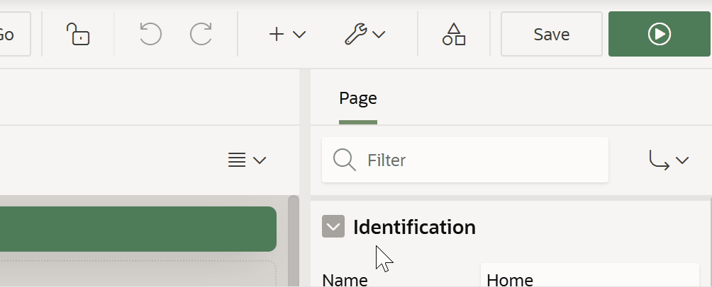
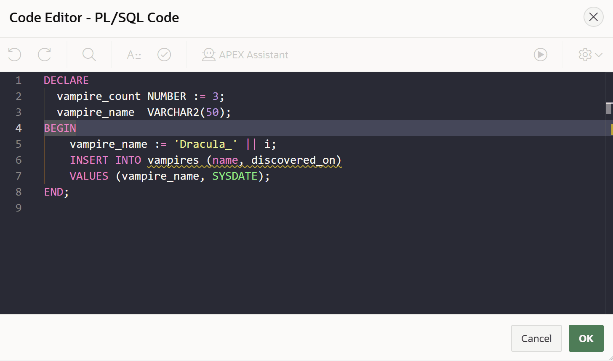
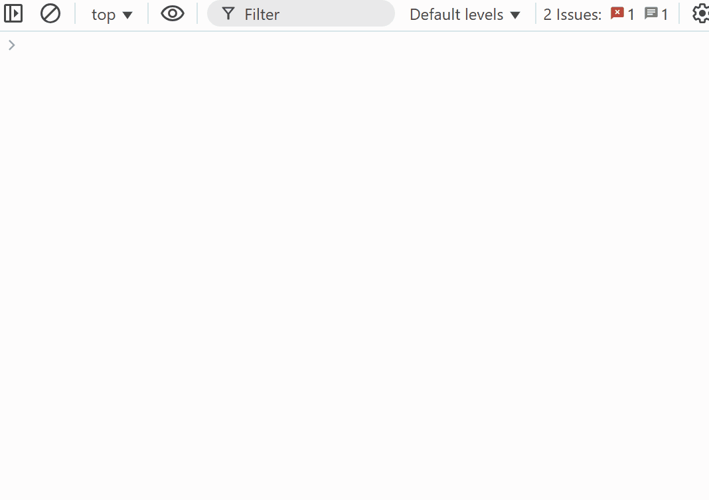
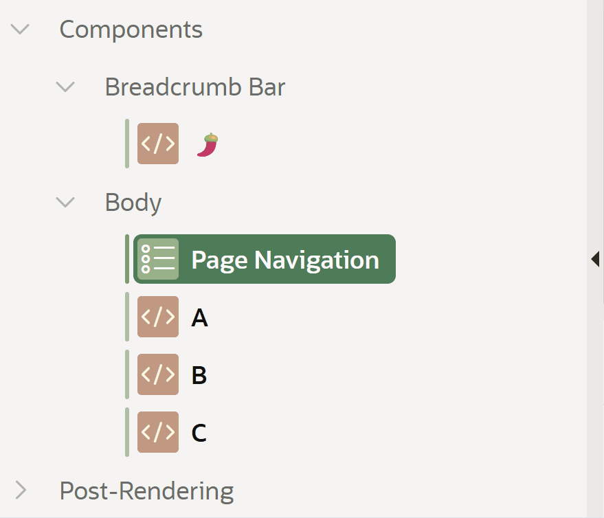
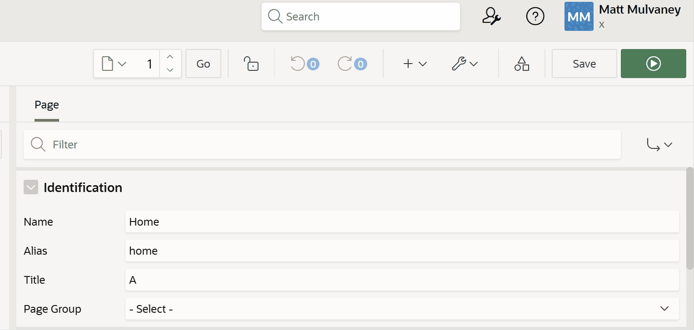
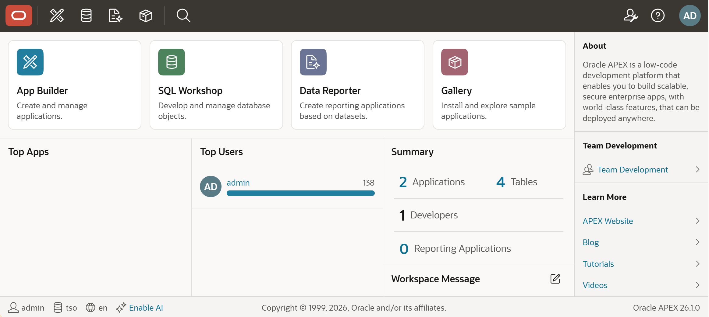
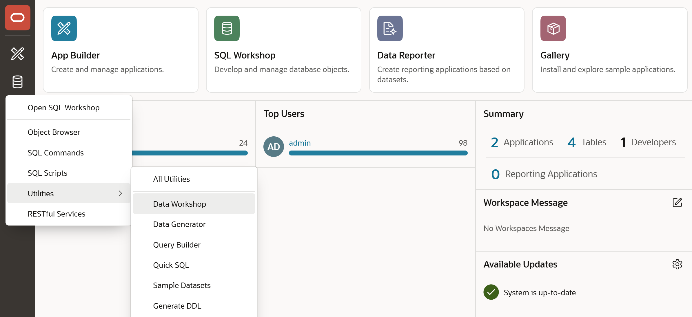
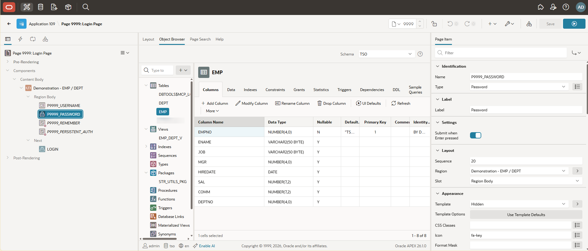

# Oracle APEX Userscripts

> **Experimental Use Only**  
> These scripts are provided for experimental use only. Use at your own risk.  
> Not supported by Oracle or my employer.

A collection of userscripts to enhance the Oracle APEX development experience. Each script targets specific productivity or usability improvements for Oracle APEX developers and administrators.

---

## Table of Contents

1. [Overview](#overview)
2. [Script Previews](#script-previews)
3. [Script Details](#script-details)
4. [Using These Userscripts with Tampermonkey](#using-these-userscripts-with-tampermonkey)
5. [License](#license)

---

## Overview

This repository contains the following userscripts for Oracle APEX:

| Script Name | Version   | Description |
|-------------|-----------|-------------|
| [Auto-hide Header](scripts/oracle-apex-auto-hide-header/readme.md) | 24.2.2 | Collapses the Oracle APEX header and expands it on hover, with user-configurable settings. Provides more screen for small displays.  |
| [Monaco Theme](scripts/oracle-apex-monaco-theme/readme.md) | 24.2.1 | Applies custom themes (e.g., Dracula) to the Monaco Editor in Oracle APEX. |
| [Page Designer Shortcuts](scripts/oracle-apex-page-designer-shortcuts/readme.md) | 24.2.5 | Adds global keyboard shortcuts for common actions in Oracle APEX Page Designer, such as saving and running pages. |
| [Session Auto-Extender](scripts/oracle-apex-session-auto-extender/readme.md) | 24.2.2 | Automatically extends your APEX session to prevent idle timeouts, with customizable intervals. |
| [Toggle Comment Out](scripts/oracle-apex-toggle-comment-out/readme.md) | 26.1.1 | Adds a keyboard shortcut to toggle the "Comment Out" build option for selected components in the Page Designer. Compatible with APEX 24.2 and 26.1+. |
| [Page Designer Undo/Redo Counters](scripts/oracle-apex-page-designer-undo-redo-counters/readme.md) | 26.1.1 | Shows live undo and redo counts next to Page Designer toolbar buttons using native badge styling. |
| [No Border Attributes](scripts/oracle-apex-no-border-attributes/readme.md) | 26.1.2 | Removes the visible borders added to property editor fields in APEX 26.1, restoring the subtle appearance from 24.2. Requires APEX 26.1+. |
| [Top Level Navigation](scripts/oracle-apex-top-level-navigation/readme.md) | 26.1.1 | Relocates the left-side black navigation menu in the APEX 26.1 builder to a slim horizontal bar across the top of the page. Requires APEX 26.1+. |
| [Builder Click Menus](scripts/oracle-apex-builder-click-menus/readme.md) | 26.1.1 | Converts the hover menus on App Builder and SQL Workshop in the APEX 26.1 builder navigation into click-to-open menus, with the original links kept as the first menu item. Requires APEX 26.1+. |
| [Object Browser in Page Designer](scripts/oracle-apex-obj-browser-in-pd/readme.md) | 26.1.1 | Adds an "Object Browser" tab to the right of the Layout tab in the APEX 26.1 Page Designer, so you can browse schema objects without leaving the page you are editing. Requires APEX 26.1+. |

---

## Script Previews

### Auto-hide Header

### Monaco Theme

### Page Designer Shortcuts

### Session Auto-Extender

### Toggle Comment Out

### Page Designer Undo/Redo Counters

### No Border Attributes

### Top Level Navigation

### Builder Click Menus

### Object Browser in Page Designer

---

## Script Details

### 1. Auto-hide Header
- **Location:** [`scripts/oracle-apex-auto-hide-header/readme.md`](scripts/oracle-apex-auto-hide-header/readme.md)
- **Description:** Automatically collapses the Oracle APEX header and expands it on hover. User-configurable trigger bar, delay, and transition.

### 2. Monaco Theme
- **Location:** [`scripts/oracle-apex-monaco-theme/readme.md`](scripts/oracle-apex-monaco-theme/readme.md)
- **Description:** Applies custom themes (e.g., Dracula) to the Monaco Editor in Oracle APEX. Easily switch themes by editing the script.

### 3. Page Designer Shortcuts
- **Location:** [`scripts/oracle-apex-page-designer-shortcuts/readme.md`](scripts/oracle-apex-page-designer-shortcuts/readme.md)
- **Description:** Adds global keyboard shortcuts for common actions in Oracle APEX Page Designer, such as saving and running pages.

### 4. Session Auto-Extender
- **Location:** [`scripts/oracle-apex-session-auto-extender/readme.md`](scripts/oracle-apex-session-auto-extender/readme.md)
- **Description:** Automatically extends your APEX session to prevent idle timeouts, with customizable intervals.

### 5. Toggle Comment Out
- **Location:** [`scripts/oracle-apex-toggle-comment-out/readme.md`](scripts/oracle-apex-toggle-comment-out/readme.md)
- **Description:** Adds a keyboard shortcut to toggle the "Comment Out" build option for selected components in the Page Designer.

### 6. Page Designer Undo/Redo Counters
- **Location:** [`scripts/oracle-apex-page-designer-undo-redo-counters/readme.md`](scripts/oracle-apex-page-designer-undo-redo-counters/readme.md)
- **Description:** Shows live undo and redo counts beside the Page Designer toolbar Undo/Redo buttons. Uses native `a-Button-badge` styling and theme utility classes; configurable to hide zero counts.

### 7. No Border Attributes
- **Location:** [`scripts/oracle-apex-no-border-attributes/readme.md`](scripts/oracle-apex-no-border-attributes/readme.md)
- **Description:** Removes the visible borders added to property editor fields in APEX 26.1, restoring the subtle appearance from 24.2. Requires APEX 26.1+.

### 8. Top Level Navigation
- **Location:** [`scripts/oracle-apex-top-level-navigation/readme.md`](scripts/oracle-apex-top-level-navigation/readme.md)
- **Description:** Relocates the left-side black navigation menu in the APEX 26.1 builder to a slim horizontal bar across the top of the page, reclaiming horizontal space. Requires APEX 26.1+.

### 9. Builder Click Menus
- **Location:** [`scripts/oracle-apex-builder-click-menus/readme.md`](scripts/oracle-apex-builder-click-menus/readme.md)
- **Description:** Converts the hover menus on App Builder and SQL Workshop in the APEX 26.1 builder navigation into click-to-open menus (like Administration). The original links stay available as the first item of each menu, or via Ctrl+click / middle-click. Requires APEX 26.1+.

### 10. Object Browser in Page Designer
- **Location:** [`scripts/oracle-apex-obj-browser-in-pd/readme.md`](scripts/oracle-apex-obj-browser-in-pd/readme.md)
- **Description:** Adds an "Object Browser" tab to the right of the Layout tab in the APEX 26.1 Page Designer, so you can browse schema objects without leaving the page you are editing. Requires APEX 26.1+.

---

## Using These Userscripts with Tampermonkey

To use these userscripts in your browser with [Tampermonkey](https://www.tampermonkey.net/):

1. **Install Tampermonkey:**  
   Download and install the Tampermonkey extension for your browser.

2. **Add a Script:**  
   - Click the Tampermonkey icon in your browser toolbar.
   - Choose "Create a new script..." from the menu.

3. **Copy Script Code:**  
   - Open the desired userscript file from this repository (e.g., in the `scripts/` folder).
   - Copy the entire script code.

4. **Paste and Save:**  
   - Paste the code into the Tampermonkey editor.
   - Click **File > Save** (or press `Ctrl+S`).

5. **Reload Oracle APEX:**  
   - Refresh your Oracle APEX page to activate the userscript.

You can enable, disable, or remove scripts at any time from the Tampermonkey dashboard.

---

## License

See [LICENSE](LICENSE) for license details.
