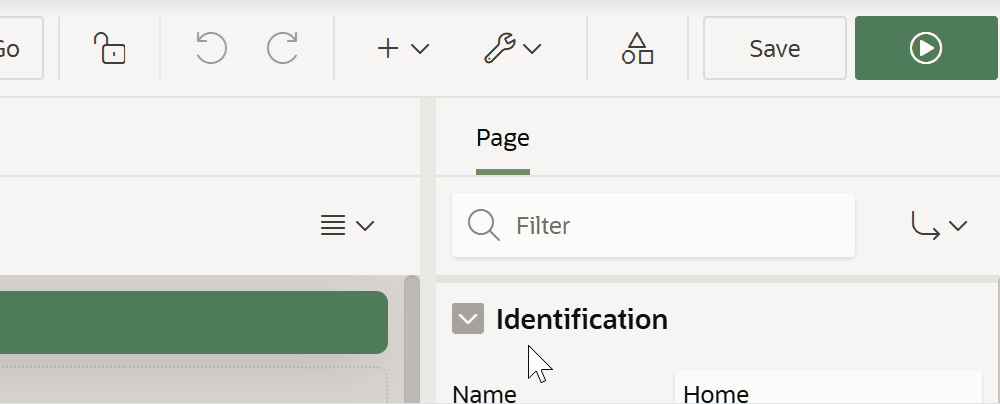

# Oracle APEX Auto-hide Header

**Version:** 24.2.1  
**Author:** Matt Mulvaney (@Matt_Mulvaney)  
**Last Updated:** August 2025

> **Experimental Use Only**  
> This script is provided for experimental use only. Use at your own risk.  
> Not supported by Oracle or my employer.

**[View script.js](script.js)**

This userscript automatically collapses the Oracle APEX header (`.a-Header`) and expands it when you hover at the top of the page. It provides user-configurable settings for trigger bar appearance, collapse delay, and transition speed.

**Features:**
- Collapses the header for more screen space.
- Expands header on mouse hover.
- Customizable trigger bar (color, height, opacity).
- Instant initial collapse and smooth transitions.
- Only runs in the main window (not in modals/iframes).
