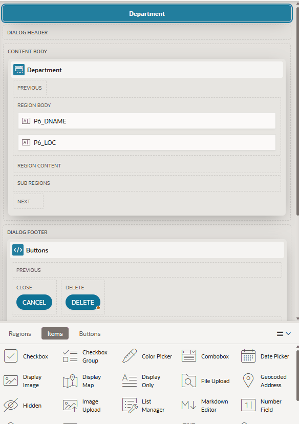

# Oracle APEX Layout View Colors

**Version:** 26.1.1  
**Author:** Matt Mulvaney (@Matt_Mulvaney)  
**Last Updated:** July 2026

> **Experimental Use Only**
> This script is provided for experimental use only. Use at your own risk.
> Not supported by Oracle or my employer.

**[View script.js](script.js)**

Ports APEX 24.2's Page Designer Layout view drag-and-drop colors onto APEX 26.1, since 26.1's own colors are all one flat, uniform amber that make it hard to tell valid drop targets, the actual drop placeholder, and the hovered slot apart from each other.

As soon as you start dragging anything in the Layout view - a region, item, or button - APEX 26.1 adds an `is-active` class to every container that could legally accept the drop and fills all of them with the same solid-looking amber (`rgba(250, 205, 98, .6)`), while the drop placeholder and the specific slot under the cursor render as barely-distinguishable shades of that same color. APEX 24.2 uses four visually distinct colors for those same four states. Every value in this script was read directly out of each version's live Page Designer stylesheet via CSSOM (`document.styleSheets`), then ported from 24.2 onto 26.1 as-is - no redesign, just 24.2's own selectors and colors.

**Features:**
- All valid drop targets (`.a-GridLayout-buttons`, `.a-GridLayout-items`, `.a-GridLayout-regions` while `is-active`, plus the matching grid cell border) get 24.2's pale cream wash (`rgb(255, 248, 227)` / `rgb(255, 235, 176)`) instead of 26.1's saturated amber.
- The drop placeholder (`.a-GridLayout-placeholder`) gets its own distinct, more saturated gold (`rgb(252, 227, 163)`), separate from the general wash.
- The specific container under the cursor (APEX's own per-slot `:hover` rule) gets 24.2's cream fill and faint inset shadow inside a region, or just a subtle dark border outside one (e.g. dialog header/footer), instead of 26.1's near-white `#fdf2e5` fill.
- Scoped entirely to the Layout view's own CSS classes, so nothing else in the builder is affected.
- Applies at `document-start` via a static stylesheet, so there's no flash of 26.1's colors before the fix kicks in.

**Notes:**
- Requires APEX 26.1+ (24.2's Layout view already uses these colors natively).
- These rules are injected by a stylesheet chunk that only loads once the Layout view is used, rather than being part of the builder's initial CSS - confirmed by inspecting each version's live CSSOM while dragging, since none of it is visible in a static page source.
