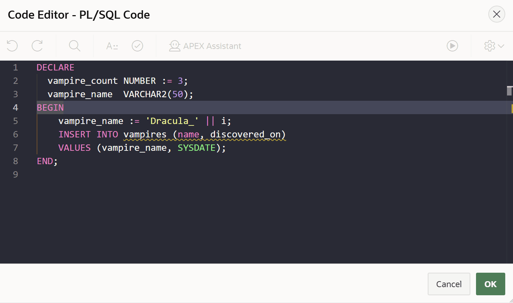

# Oracle APEX Monaco Editor Theme Changer

**Version:** 24.2.1  
**Author:** Matt Mulvaney (@Matt_Mulvaney)  
**Last Updated:** August 2025

> **Experimental Use Only**  
> This script is provided for experimental use only. Use at your own risk.  
> Not supported by Oracle or my employer.

**[View script.js](script.js)**

This userscript allows you to apply custom themes (such as Dracula) to the Monaco Editor within Oracle APEX. Easily switch themes by changing a single variable in the script.

**Features:**
- Custom Monaco Editor themes for APEX.
- Default theme: Dracula (can be changed).
- Automatically applies the theme to all Monaco editors in APEX.
- Designed for APEX applications (APP_ID 3000–8999).
