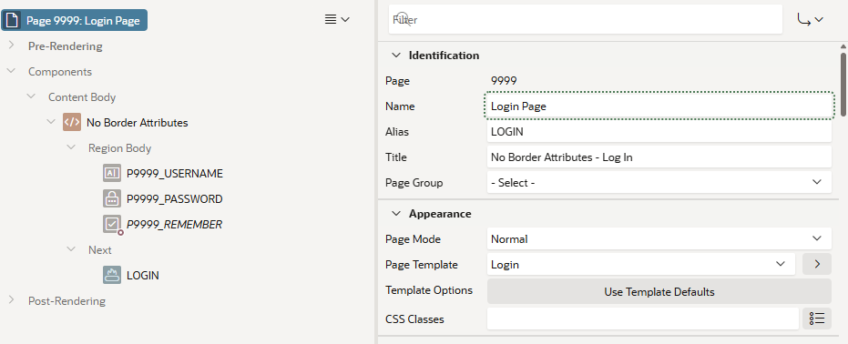

# Oracle APEX Page Designer No Border Attributes

**Version:** 26.1.0  
**Author:** Matt Mulvaney (@Matt_Mulvaney)  
**Last Updated:** May 2026

> **Experimental Use Only**  
> This script is provided for experimental use only. Use at your own risk.  
> Not supported by Oracle or my employer.

**[View script.js](script.js)**

This userscript removes the visible borders added to property editor fields in APEX 26.1, restoring the subtle appearance from 24.2.

**Features:**
- Removes solid borders from all `.a-Property-field` elements in the Page Designer.
- Restores the 24.2 box-shadow and dotted green focus outline.
- Fixes focus outline clipping on the first field under each property group heading.
- Only active in the Page Designer (App 4000, Page 4500).

**APEX Version Compatibility:**
- Requires APEX 26.1 or above (checked at runtime via `apex.env.APEX_VERSION`).
