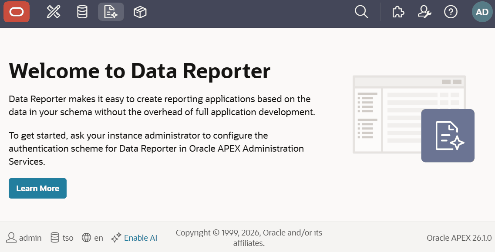

# Oracle APEX Pets

**Version:** 26.1.2  
**Author:** Matt Mulvaney (@Matt_Mulvaney)  
**Last Updated:** July 2026

> **Experimental Use Only**  
> This script is provided for experimental use only. Use at your own risk.  
> Not supported by Oracle or my employer.

**[View script.js](script.js)**

This userscript adds cute roaming pets to the Oracle APEX top navigation bar. Your chosen animals walk back and forth along the header, bringing a little life to your APEX builder — inspired by the [vscode-pets](https://github.com/tonybaloney/vscode-pets) VS Code extension.

**Features:**
- 21 pet types: chicken, clippy, cockatiel, crab, deno, dog, fox, horse, mod, monkey, morph, panda, rat, rocky, rubber duck, skeleton, snail, snake, totoro, turtle and zappy
- Authentic vscode-pets movement: 100ms tick, per-pet randomized speed (snail and turtle are slower; rocky never moves)
- **Throw Ball**: launch a bouncing ball — pets run after it and the winner carries it off (same physics as vscode-pets)
- Click a pet to make it swipe (silently — no speech bubbles)
- Configure how many of each animal (0-10) via **Account menu → Pets → Settings**
- Preferences persist in localStorage
- GIFs preloaded to avoid loading flashes; subtle glow so sprites read against the dark bar
- Pets and the ball stay within the header's own width, so they don't wander into the margins if the nav bar is narrower than the window (e.g. with the Centered Layout userscript)

**Dependencies:**
- **Requires:** `oracle-apex-top-level-navigation` userscript (pets roam along the top navigation bar)

**How To Use:**
1. Open the Account menu (your avatar, top right) and choose **Pets → Settings**
2. Use the +/− buttons to pick how many of each animal you want (0-10 each)
3. Close the dialog — the pets on the bar update immediately
4. Choose **Pets → Throw Ball** and watch them chase it
5. Click any pet to make it swipe

**APEX Version Compatibility:**
- Targets the APEX 26.1+ builder UI
- Only appears when the top navigation header (`.b-Header`) is present

**Credits:**
- Pet artwork, animations and behaviour are from the open source [vscode-pets](https://github.com/tonybaloney/vscode-pets) project by Anthony Shaw ([@tonybaloney](https://github.com/tonybaloney)) and contributors, used under the [MIT License](https://github.com/tonybaloney/vscode-pets/blob/main/LICENSE).
- See the full list of artists and contributors in the project's [credits](https://github.com/tonybaloney/vscode-pets#credits).
