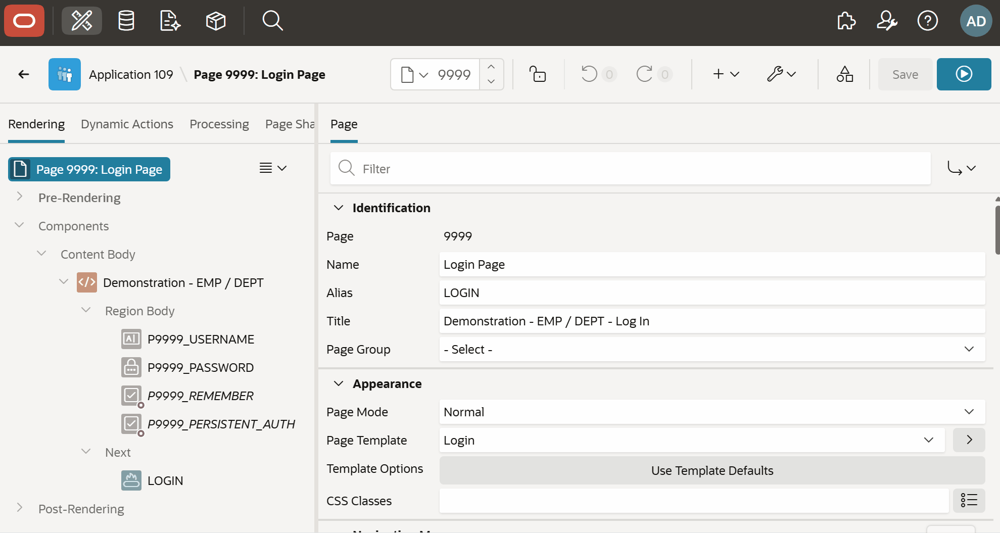

# Oracle APEX Shared Components Menu

**Version:** 26.1.2  
**Author:** Matt Mulvaney (@Matt_Mulvaney)  
**Last Updated:** July 2026

> **Experimental Use Only**  
> This script is provided for experimental use only. Use at your own risk.  
> Not supported by Oracle or my employer.

**[View script.js](script.js)**

In the APEX 26.1 builder, the Shared Components toolbar button navigates away from the current page to the full Shared Components page. This userscript converts it into a native APEX drop-down menu so you can jump directly to any section from anywhere in the builder — Page Designer, the page listing, component pages, and more.

**Features:**
- Shared Components button opens a drop-down menu on click instead of navigating away.
- By default, each section (User Interface, Navigation and Search, Security, Application Logic, Other Components, Files and Reports, Data Sources, Workflows and Automations, Globalization, Generative AI) appears as a heading with its own submenu. Set `USE_SUBMENUS = false` near the top of the script to restore the original flat list with disabled heading rows instead.
- An "Open Shared Components" entry at the top of the menu preserves access to the full Shared Components page.
- URLs inject the current builder session automatically, so links work without re-authenticating.
- App-scoped pages (Security Attributes, Globalization Attributes) include `fb_flow_id` when the edited application ID can be determined from the page context.
- Falls back to the original button behaviour if the APEX menu widget is unavailable.
- Only active on APEX internal builder applications (App IDs 3000–8999).

**APEX Version Compatibility:**
- Requires APEX 26.1 or above (checked at runtime via `apex.env.APEX_VERSION`).

**Menu Sections:**

| Section | Items |
|---|---|
| Application Logic | Application Definition, Application Items, Application Processes, Application Computations, Application Settings, Build Options |
| Security | Security Attributes, Authentication Schemes, Authorization Schemes, Application Access Control, Session State Protection |
| Other Components | Lists of Values, Plug-ins, Component Settings, Shortcuts, Component Groups, Data Load Definitions |
| Navigation and Search | Lists, Navigation Menu, Breadcrumbs, Navigation Bar List, Search Configurations |
| User Interface | User Interface Attributes, Progressive Web App, Themes, Templates, Email Templates, Map Backgrounds |
| Files and Reports | Static Application Files, Static Workspace Files, Report Layouts, Report Queries |
| Data Sources | REST Data Sources, JSON Duality Views, JSON Sources |
| Workflows and Automations | Task Definitions, Automations, Workflows |
| Globalization | Globalization Attributes, Text Messages, Application Translations |
| Generative AI | AI Attributes, AI Agents, AI Services |
